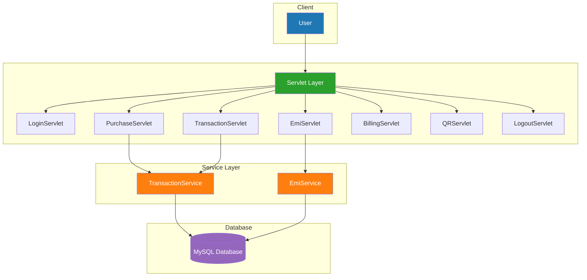
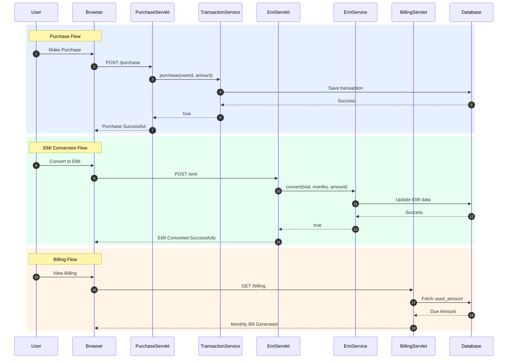
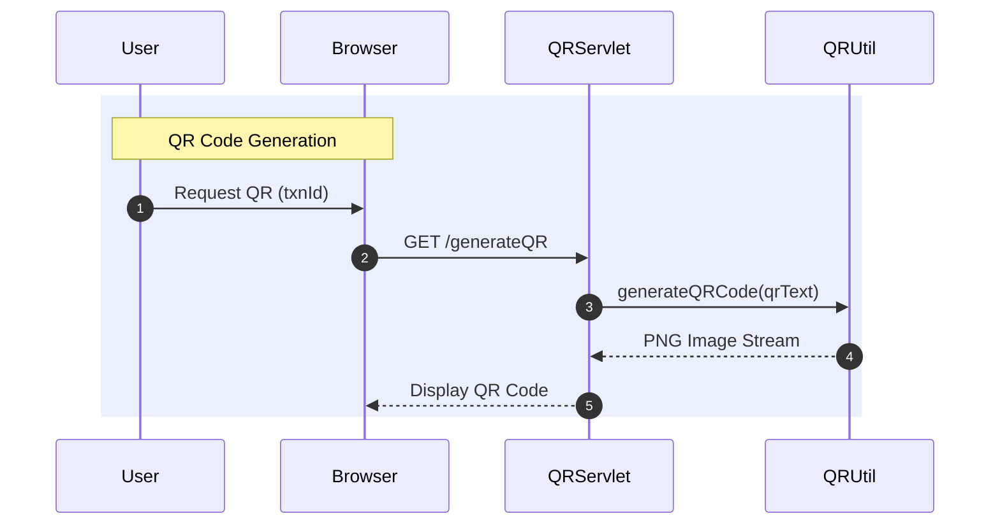

## 🏗️ System Architecture

```mermaid
graph TD

%% Layers
subgraph Client
A[User]
end

subgraph " "
B[Servlet Layer]
C1[LoginServlet]
C2[PurchaseServlet]
C3[TransactionServlet]
C4[EmiServlet]
C5[BillingServlet]
C6[QRServlet]
C7[LogoutServlet]
end

subgraph Service Layer
D1[TransactionService]
D2[EmiService]
end

subgraph Database
E[(MySQL Database)]
end

%% Flow
A --> B
B --> C1
B --> C2
B --> C3
B --> C4
B --> C5
B --> C6
B --> C7

C2 --> D1
C3 --> D1
C4 --> D2

D1 --> E
D2 --> E

%% Styling
style A fill:#1f77b4,color:#fff
style B fill:#2ca02c,color:#fff
style D1 fill:#ff7f0e,color:#fff
style D2 fill:#ff7f0e,color:#fff
style E fill:#9467bd,color:#fff
```

---

## 🔄 Transaction Flow

```mermaid
sequenceDiagram
    autonumber

    participant U as User
    participant B as Browser
    participant PS as PurchaseServlet
    participant TS as TransactionService
    participant ES as EmiServlet
    participant EMS as EmiService
    participant BS as BillingServlet
    participant DB as Database

    %% Purchase Section
    rect rgb(230, 240, 255)
    Note over U,B: Purchase Flow
    U->>B: Make Purchase
    B->>PS: POST /purchase
    PS->>TS: purchase(userId, amount)
    TS->>DB: Save transaction
    DB-->>TS: Success
    TS-->>PS: true
    PS-->>B: Purchase Successful
    end

    %% EMI Section
    rect rgb(230, 255, 240)
    Note over U,B: EMI Conversion Flow
    U->>B: Convert to EMI
    B->>ES: POST /emi
    ES->>EMS: convert(txId, months, amount)
    EMS->>DB: Update EMI data
    DB-->>EMS: Success
    EMS-->>ES: true
    ES-->>B: EMI Converted Successfully
    end

    %% Billing Section
    rect rgb(255, 245, 230)
    Note over U,B: Billing Flow
    U->>B: View Billing
    B->>BS: GET /billing
    BS->>DB: Fetch used_amount
    DB-->>BS: Due Amount
    BS-->>B: Monthly Bill Generated
    end
```
---
## 🔄 QR Code Generation Flow

```mermaid
sequenceDiagram
    autonumber

    participant U as User
    participant B as Browser
    participant QS as QRServlet
    participant QR as QRUtil

    %% QR Section
    rect rgb(235, 240, 255)
    Note over U,B: QR Code Generation
    U->>B: Request QR (txnId)
    B->>QS: GET /generateQR
    QS->>QR: generateQRCode(qrText)
    QR-->>QS: PNG Image Stream
    QS-->>B: Display QR Code
    end
```
