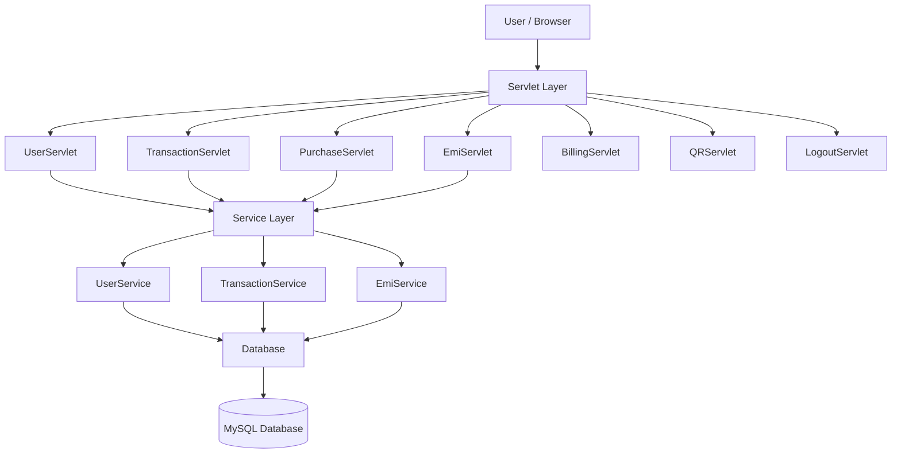

## 🏗️ System Architecture

```mermaid
graph TD

A[User / Browser] --> B[Servlet Layer]

B --> C1[UserServlet]
B --> C2[TransactionServlet]
B --> C3[PurchaseServlet]
B --> C4[EmiServlet]
B --> C5[BillingServlet]
B --> C6[QRServlet]
B --> C7[LogoutServlet]

C1 --> D[Service Layer]
C2 --> D
C3 --> D
C4 --> D

D --> E1[UserService]
D --> E2[TransactionService]
D --> E3[EmiService]

E1 --> F[Database]
E2 --> F
E3 --> F

F --> G[(MySQL Database)]
```