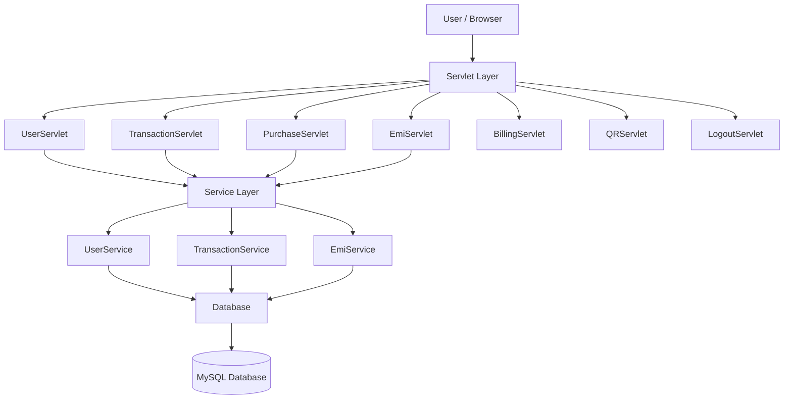
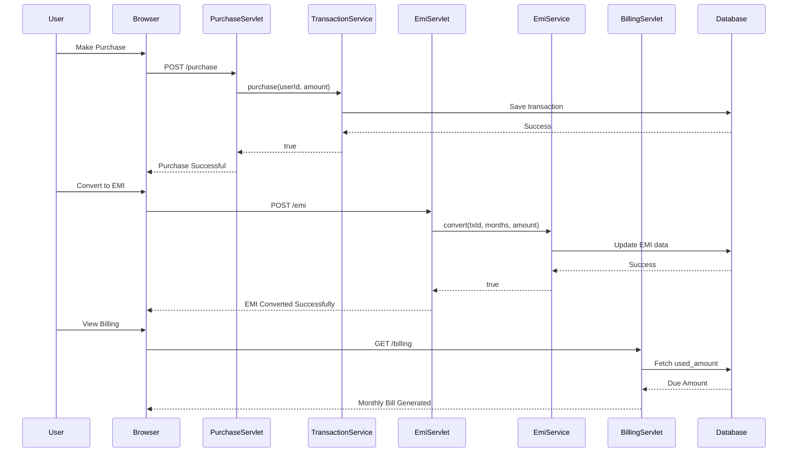
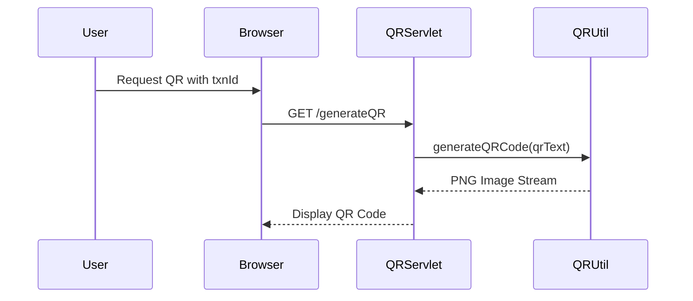

## 🏗️ System Architecture

```mermaid
graph TD

A[User / Browser] --> B[Servlet Layer]

B --> C1[UserServlet]
B --> C2[TransactionServlet]
B --> C3[PurchaseServlet]
B --> C4[EmiServlet]
B --> C5[BillingServlet]
B --> C6[QRServlet]
B --> C7[LogoutServlet]

C1 --> D[Service Layer]
C2 --> D
C3 --> D
C4 --> D

D --> E1[UserService]
D --> E2[TransactionService]
D --> E3[EmiService]

E1 --> F[Database]
E2 --> F
E3 --> F

F --> G[(MySQL Database)]
```

---

## 🔄 Purchase + EMI + Billing Flow

```mermaid
sequenceDiagram
    participant User
    participant Browser
    participant PurchaseServlet
    participant TransactionService
    participant EmiServlet
    participant EmiService
    participant BillingServlet
    participant Database

    User->>Browser: Make Purchase
    Browser->>PurchaseServlet: POST /purchase
    PurchaseServlet->>TransactionService: purchase(userId, amount)
    TransactionService->>Database: Save transaction
    Database-->>TransactionService: Success
    TransactionService-->>PurchaseServlet: true
    PurchaseServlet-->>Browser: Purchase Successful

    User->>Browser: Convert to EMI
    Browser->>EmiServlet: POST /emi
    EmiServlet->>EmiService: convert(txId, months, amount)
    EmiService->>Database: Update EMI data
    Database-->>EmiService: Success
    EmiService-->>EmiServlet: true
    EmiServlet-->>Browser: EMI Converted Successfully

    User->>Browser: View Billing
    Browser->>BillingServlet: GET /billing
    BillingServlet->>Database: Fetch used_amount
    Database-->>BillingServlet: Due Amount
    BillingServlet-->>Browser: Monthly Bill Generated
```

---

## 🔄 QR Code Generation Flow

```mermaid
sequenceDiagram
    participant User
    participant Browser
    participant QRServlet
    participant QRUtil

    User->>Browser: Request QR with txnId
    Browser->>QRServlet: GET /generateQR
    QRServlet->>QRUtil: generateQRCode(qrText)
    QRUtil-->>QRServlet: PNG Image Stream
    QRServlet-->>Browser: Display QR Code
```

